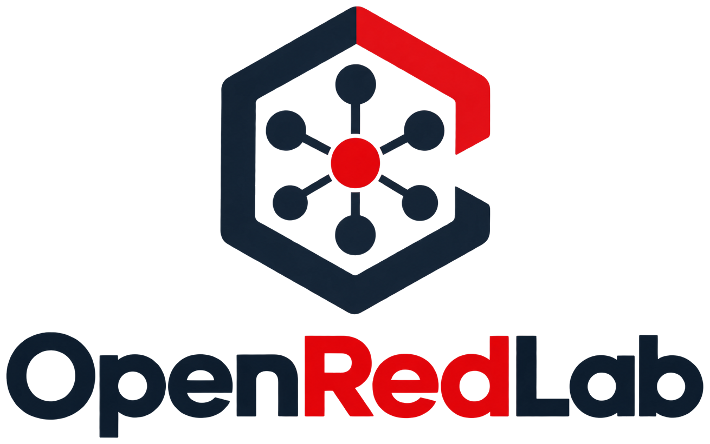

<p align="center">
  <picture>
    <source media="(prefers-color-scheme: dark)" srcset="img/openredlab-blanco.png">
    
  </picture>
</p>

# OpenRedLab

**Simulador de redes para aprender direccionamiento IP, subredes y diagnóstico.** Armás una red en el navegador, configurás direcciones, máscaras, puertas de enlace y rutas, y al hacer ping ves el recorrido del paquete paso a paso. Si falla, el simulador te dice en qué paso se cortó y por qué.

**Usalo online:** https://fhleonardi.github.io/openredlab/

No hace falta instalar nada: es un único archivo HTML, sin dependencias y sin conexión a internet. También podés descargar [`index.html`](index.html) y abrirlo con doble clic. Tu trabajo se guarda solo en el navegador: la próxima vez que lo abras, te ofrece recuperarlo.

**Guías:** [para el alumno](docs/guia-rapida-alumno.md) · [para docentes](docs/guia-docente.md), que explica cómo usarlo en clase y cómo armar laboratorios y desafíos.

## Qué podés hacer

- **Armar la red** con PC, servidores, routers, firewalls, switches, cámaras, dispositivos IoT, puntos de acceso y una nube Internet, unidos por cables de cobre, fibra o enlaces inalámbricos.
- **Elegir el equipo como en la realidad:** un router estándar (g0/0, fib0…) o tipo MikroTik (ether1, sfp1…), un firewall (wan, lan, dmz), switches de 8, 24 o 48 puertos, o un hub. En routers y firewalls podés agregar o quitar puertos y elegir el medio de cada uno.
- **Hacer ping** entre equipos o a un nombre (google.com) y seguir el recorrido: la decisión con IP «AND» máscara, la puerta de enlace, ARP, las tablas de rutas de cada router y la vuelta de la respuesta.
- **Ver las capas y el encapsulamiento:** cada paso del recorrido dice en qué capa ocurre (modelos OSI y TCP/IP), y *Cómo viaja el paquete* muestra las tramas de cada tramo: cambian las MAC en cada router, el paquete IP conserva su origen y su destino y el TTL baja uno por router.
- **Conectarse a servicios con TCP y UDP:** un servidor atiende HTTP, HTTPS, SSH, FTP, SMTP o un puerto propio; *Conectar* muestra el socket (IP:puerto ↔ IP:puerto), el handshake de tres pasos, el pedido y la respuesta, y el cierre, o los datagramas de UDP. Si nadie escucha en el puerto, el diagnóstico lo dice (D31): la red llega, el servicio no.
- **Capturar el tráfico como Wireshark:** la pestaña *Captura* registra lo que pasa por un cable (o por todos) mientras hacés pings, consultas DNS y conexiones: número, origen, destino, protocolo e info, el detalle por capas de cada paquete y un filtro (`icmp`, `dns`, `tcp.port==80`, `ip.addr==…`).
- **Medir la calidad del enlace (QoS):** cada cable tiene latencia, jitter y pérdida; el ping manda 1, 4, 10 o 50 paquetes y, como el ping real, informa los perdidos y el tiempo mínimo, medio y máximo. Si no vuelve ninguno, el diagnóstico lo explica (D32).
- **Ver los dominios de colisión y de broadcast:** el selector *Dominios* del lienzo pinta cada dominio con un color y los cuenta. El hub repite cada trama por todos sus puertos; el switch separa un dominio de colisión por puerto; el router corta el broadcast.
- **Resolver nombres con DNS:** un servidor DNS propio con su zona (registros A, CNAME, MX y NS) y, para los nombres de internet, la resolución por la jerarquía: consulta recursiva al servidor y consultas iterativas a la raíz, al TLD y al autoritativo, con caché. **Consultar DNS** muestra la respuesta como `nslookup`, para cualquier tipo de registro.
- **Entender las fallas:** cada problema tiene un diagnóstico (D01 a D33) que explica qué pasó en lenguaje llano y sugiere qué revisar: máscara mal elegida, puerta de enlace fuera de la red, ruta de vuelta faltante, IP duplicada, cable caído, regla de filtrado, entre otros.
- **Calcular subredes** con el equipo seleccionado: IP y máscara en binario, clase de la IP (y si es privada o pública), red, broadcast, rango de hosts y si la puerta de enlace está en la red.
- **Ver DHCP** con los cuatro mensajes DORA animados sobre los cables.
- **Salir a internet con NAT:** el router o firewall de borde cambia la IP privada de origen por su IP pública, y a la respuesta la traduce de vuelta; se ve en el recorrido y en las tramas. Sin NAT, el pedido llega pero la respuesta no vuelve, y el simulador lo explica (D28).
- **Filtrar tráfico** con reglas por red de origen y destino, protocolo (ICMP, TCP, UDP), puerto de destino y puerto por el que entra el paquete, más una política por defecto (permitir o bloquear). El router revisa cada paquete; el firewall recuerda las conversaciones y deja volver las respuestas. Un firewall nuevo bloquea lo que entra por wan.
- **Verificar un diseño VLSM:** el de un desafío del docente o uno propio. En una red armada por vos, el simulador detecta los sectores solo y revisa subredes solapadas o desalineadas y puertas de enlace; si cargás los hosts de cada sector y el bloque, también revisa si alcanzan.
- **Resolver laboratorios de diagnóstico:** redes con fallas plantadas y objetivos que hay que cumplir. En un laboratorio el simulador no avisa las fallas mientras configurás: encontrarlas es el ejercicio.
- Exportar e importar la red como JSON, deshacer y rehacer, tema oscuro y modo presentación para el aula.

## Escenarios

En el selector **Ejemplos…** vienen redes listas: una básica, dos subredes, un complejo turístico completo, el mismo complejo con fallas, un desafío VLSM, un router de 8 puertos, una oficina con DNS propio y cuatro topologías: estrella, bus (con un hub), malla entre routers y dos LAN unidas por una WAN, y dos proveedores de internet unidos por peering, con un proveedor de tránsito.

En [`escenarios/`](escenarios/) hay archivos para abrir con **Importar** o arrastrándolos al lienzo:

| Archivo | Para qué |
|---|---|
| `lab1-ALUMNO.json` | Lab 1: un solo problema |
| `lab2-ALUMNO.json` | Lab 2: tres problemas |
| `lab3-ALUMNO.json` | Lab 3: el problema invisible |
| `lab4-ALUMNO.json` | Lab 4: la oficina sin servicios (intranet, DNS e internet) |
| `desafio-complejo-termal.json` | Desafío VLSM: Complejo Termal Río Verde, sin direccionar |

## Para docentes

- La [guía para docentes](docs/guia-docente.md) explica el uso en clase, cómo armar laboratorios y desafíos, y el formato de los archivos.
- En modo **Docente**, la pestaña **Laboratorio** arma fallas, objetivos y sectores en pantalla, eligiendo de la red abierta, y compara cada objetivo en la red sana y en la del alumno. El botón **Exportar para el alumno** genera la versión que se reparte: la red con las fallas aplicadas y sin la lista de fallas (en un desafío VLSM, sin direccionar).
- Las versiones docentes de los laboratorios incluidos, con la red resuelta, no se publican para que los alumnos no tengan las soluciones a mano. Si las necesitás, pedíselas al autor. Para armar las tuyas, el ejemplo **Complejo roto (docente)** sirve de plantilla.

## Cómo está hecho

Cinco capas en JavaScript sin dependencias. Cada una tiene sus propias autopruebas y no conoce a las siguientes:

| Capa | Archivo | Qué hace |
|---|---|---|
| 1 | [`capa1-red.js`](capa1-red.js) | Aritmética de direcciones: máscaras, subredes, binario |
| 2 | [`capa2-motor.js`](capa2-motor.js) | El motor: ping paso a paso, ARP, rutas, DHCP, DNS, filtrado y diagnósticos |
| 3 | [`capa3-escenarios.js`](capa3-escenarios.js) | Validación, importar y exportar, ejemplos, laboratorios, modelos de equipos y verificación VLSM |
| 4 | [`capa4-ui.js`](capa4-ui.js) | La interfaz: lienzo, paleta, propiedades y paneles |
| 5 | [`capa5-autotest.js`](capa5-autotest.js) | Arranque y Autotest |

`index.html` se genera a partir de las cinco capas; no se edita a mano. Después de cambiar una capa:

```sh
python3 herramientas/ensamblar.py              # reescribe index.html
python3 herramientas/ensamblar.py --verificar  # comprueba que coincida con las capas
```

Para probar, abrí `index.html` en el navegador. El botón **Autotest** muestra los casos de redes; en la consola, `Autotest.correr({ tecnico: true })` corre además los criterios de la interfaz y las autopruebas de las capas 1 a 3 (también disponibles por separado: `Red.autopruebas()`, `Motor.autopruebas()`, `Escenarios.autopruebas()`).

**Carpetas del repositorio:**

| Carpeta | Contenido |
|---|---|
| raíz | `index.html` y las cinco capas |
| [`docs/`](docs/) | Las guías para alumnos y docentes |
| [`escenarios/`](escenarios/) | Laboratorios y desafíos para importar |
| [`herramientas/`](herramientas/) | El ensamblador de `index.html` |
| [`img/`](img/) | Logo (color y blanco), marca y favicons |

## Versiones

OpenRedLab numera sus versiones como MAYOR.MENOR.PARCHE. La versión actual figura al pie de la pestaña **Ayuda**, y en [`CHANGELOG.md`](CHANGELOG.md) está lo que trajo cada una. Cada versión publicada tiene su [release](https://github.com/fhleonardi/openredlab/releases).

- **Archivos de red:** llevan el número de su formato (`version`, hoy 1) y la versión del simulador que los exportó (`generador`).
  - El formato sólo cambia si un dato existente cambia o desaparece. Un archivo de un formato anterior se actualiza solo al abrirlo.
  - Un archivo de un formato más nuevo no se abre: el simulador dice con qué versión se hizo.
- **Para contribuir:** cada cambio a una capa sube la versión en `Escenarios.VERSION_APP` (`capa3-escenarios.js`) y suma su entrada al tope de `CHANGELOG.md`. Si no coinciden, `ensamblar.py` no arma el `index.html`. Al mergear, la versión se publica con su tag (`vX.Y.Z`) y su release.

## Simplificaciones

Es una herramienta para aprender, no un emulador: las rutas se cargan a mano (no hay OSPF, BGP ni RIP), no hay VLAN ni IPv6, el NAT es sólo de salida (sin redirección de puertos), no hay retransmisiones ni control de congestión en TCP, DHCP reparte un rango por router y sin relay, y el wireless se modela por distancia. La pestaña **Ayuda** del simulador lista todas.

## Reportar un problema

Si algo no funciona como esperabas o un diagnóstico explica mal lo que pasó, abrí un [issue](https://github.com/fhleonardi/openredlab/issues) con la red exportada (*Exportar*) y los pasos para reproducirlo.

## Quién lo hace

OpenRedLab lo desarrolla Francisco Leonardi con [Open Tecnología](https://opentecnologia.ar), una empresa de servicios de IT de Gualeguaychú, Entre Ríos. Nació para la cátedra de redes y se publica como código abierto para que cualquier docente o alumno lo use y lo mejore.

## Licencia

[MIT](LICENSE) © 2026 Francisco Leonardi
